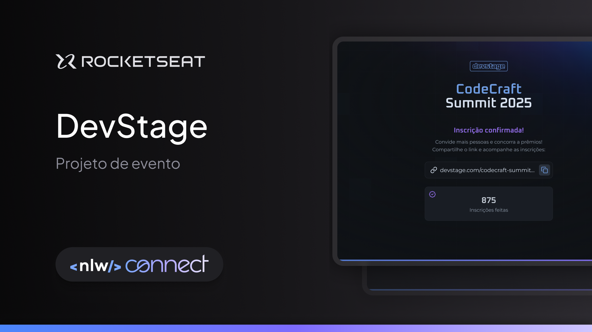

# NLW Connect Referral API

O projeto é a construção da API de um site responsivo de inscrição e indicação para eventos.

Esse é um projeto do evento NLW Connect, promovido pela ROcketseat em 2025.

## Figma



## Tech Stack

**Server:** Node, Fastify, Redis, Drizzle, Zod, Docker

## Instalação

Instalar o projeto com o `pnpm`

```bash
  pnpm install
```

Rodar o Docker para subir o Redis e o Postgres com o `docker-compose.yaml`

```bash
  docker compose up -d
```

Rodar as migration para criar as tabelas

```bash
  pnpm db:migrate
```

Inicializar o servidor

```bash
  pnpm dev
```

## Variáveis de ambiente

Para rodar o projeto, crie um arquivo `.env` na raiz com as seguintes variáveis:

`BASE_URL`

`PORT`

`POSTGRES_URL`

`REDIS_URL`

`WEB_URL`

## API Reference

#### Inscreve no evento

```http
  POST /subscriptions
```

| Parameter    | Type     | Description                                  |
| :----------- | :------- | :------------------------------------------- |
| `name`       | `string` | **Required**. Nome do participante           |
| `email`      | `string` | **Required**. email do participante          |
| `referrerId` | `string` | **Optional**. ID do participante que indicou |

#### Busca o total de indicações de um participante

```http
  GET /invites/${subscriberId}
```

| Parameter      | Type     | Description                      |
| :------------- | :------- | :------------------------------- |
| `subscriberId` | `string` | **Required**. Id do participante |

#### Busca o total de cliques através de um link de indicação de um participante

```http
  GET /subscribers/${subscriberId}/ranking/clicks
```

| Parameter      | Type     | Description                      |
| :------------- | :------- | :------------------------------- |
| `subscriberId` | `string` | **Required**. Id do participante |

#### Busca o total de indicações de um participante

```http
  GET /subscribers/${subscriberId}/ranking/count
```

| Parameter      | Type     | Description                      |
| :------------- | :------- | :------------------------------- |
| `subscriberId` | `string` | **Required**. Id do participante |

#### Busca a posição no ranking de um participante

```http
  GET /subscribers/${subscriberId}/ranking/position
```

| Parameter      | Type     | Description                      |
| :------------- | :------- | :------------------------------- |
| `subscriberId` | `string` | **Required**. Id do participante |

#### Busca o ranking total

```http
  GET /subscribers/ranking
```
